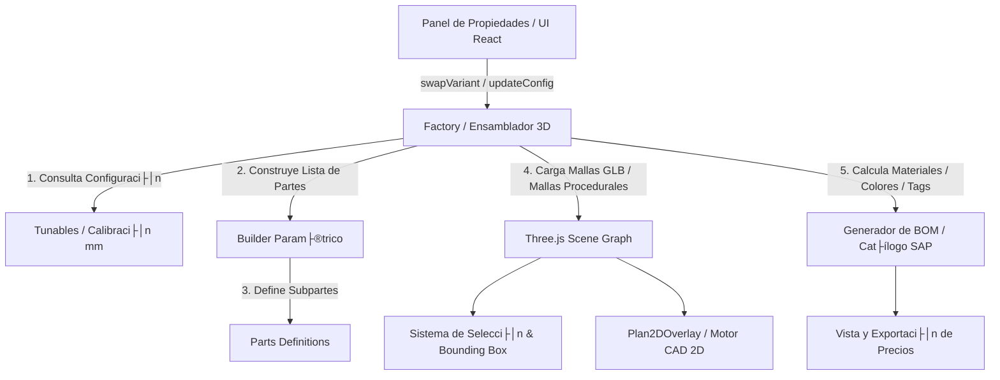
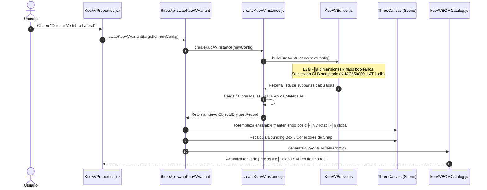

# Arquitectura y Funcionamiento del Sistema CAD 3D/2D (Proyecto Imagina)

Este documento detalla el funcionamiento t├®cnico, conceptual y operativo del configurador modular de mobiliario desarrollado en **React + Three.js + Electron**.

---

## 1. Visi├│n General de la Arquitectura

El sistema combina un motor **3D interactivo (Three.js)** y un motor **2D CAD plano (HTML5 Canvas)** bajo un modelo de datos unificado y unidireccional.



---

## 2. Composici├│n de los Productos (Assemblies)

Cada producto (por ejemplo, **KUO AV - Puesto Perimetral** o **Koncisa Plus**) se modela como un **Ensamble Compuesto (`Assembly`)**, nunca como un bloque monolítico ni como mallas sueltas.

### Jerarquía Estructural
Un `Assembly` es un `THREE.Group` contenedor que agrupa múltiples subpartes lógicas y físicas:

```
KUO_AV_ASSEMBLY (THREE.Group)
Ôö£ÔöÇÔöÇ userData (configuraci├│n, metadata, instanceId, dimensions)
Ôö£ÔöÇÔöÇ Superficie (Malla param├®trica procedural / Formica / Melamina)
Ôö£ÔöÇÔöÇ Costado Izquierdo (KUSO800000_IZQ.glb)
Ôö£ÔöÇÔöÇ Costado Derecho (KUSO800000_DER.glb)
Ôö£ÔöÇÔöÇ Viga Soporte (KUSO420000_120.glb)
Ôö£ÔöÇÔöÇ Ducto Horizontal (KUSO860000_120.glb)
Ôö£ÔöÇÔöÇ Columnas Motorizadas (KUAC1040000_74.glb x2)
Ôö£ÔöÇÔöÇ Soporte de Tomas (KUAC680000.glb)
Ôö£ÔöÇÔöÇ V├®rtebra Pasacables (KUAC650000.glb o KUAC650000_LAT 1.glb)
Ôö£ÔöÇÔöÇ Grommets / Pasacables de Superficie (LKAC250000.glb)
ÔööÔöÇÔöÇ Conectores de Snap / Puntos de anclaje (SnapPoints 3D/2D)
```

### Contrato de Metadatos de cada Pieza (`partRecord`)
Cada subpieza dentro del ensamble posee un registro estructurado:

| Propiedad | Tipo | Descripci├│n |
| :--- | :--- | :--- |
| `instanceId` | `String` | Identificador ├║nico del ensamble padre (UUID) |
| `groupId` | `String` | ID determinista del grupo funcional (ej: `kuo_av_assembly_1200x600`) |
| `code` | `String` | C├│digo SAP / Comercial oficial (ej: `22000116690`) |
| `logicalCode` | `String` | Etiqueta l├│gica de la variante (ej: `KUAC650000_ALT_LAT`) |
| `lookupTag` | `String` | Tag de indexación para el catálogo y BOM de CET |
| `dimMm` | `Object` | Dimensiones nominales en milímetros `{ widthMm, depthMm, heightMm }` |
| `position` | `Object` | Coordenadas milim├®tricas relativas `{ x, y, z }` |
| `rotation` | `Object` | Rotaci├│n en radianes / Euler `{ x, y, z }` |
| `model` | `Object` | Tipo de render (`kind: 'glb'` con ruta a archivo o `kind: 'procedural'`) |

---

## 3. Sistema de Alineaci├│n y Posicionamiento

### 1. Sistema de Coordenadas CAD
* **Eje X (Ancho / Width)**: De izquierda ($-X$) a derecha ($+X$). El origen $X=0$ es el centro sim├®trico del escritorio.
* **Eje Y (Altura / Height)**: De abajo ($Y=0$, piso) hacia arriba ($+Y$, nivel superior de superficie a $730\text{ mm}$ o $740\text{ mm}$).
* **Eje Z (Profundidad / Depth)**: De adelante (usuario, $+Z$) hacia atrás (visitante / pasillo, $-Z$).

### 2. Archivo Central de Calibraci├│n (`kuoAVTunables.js`)
Para evitar "números mágicos" dispersos en el código, cada elemento físico tiene una entrada en `KUO_AV_CALIBRATION`:

```javascript
// Ejemplo en kuoAVTunables.js
vertebraLateral: {
  codigo: '22000116690',
  glb: 'KUAC650000_LAT 1.glb',
  posicionMm: {
    x: -285.0, // <-- Distancia en mm desde el centro (fácilmente editable)
    y: 430.9,  // <-- Nivel vertical sobre el ducto
    z: -248.0, // <-- Alineaci├│n en profundidad
  },
  rotacionDeg: {
    x: 0,
    y: 180,    // <-- Rotaci├│n can├│nica para encajar en el paral
    z: 0,
  }
}
```

### 3. Pipeline de Transformaci├│n (`applyAssetTransform`)
Cuando se carga un archivo `.glb`, el motor:
1. Normaliza la posici├│n del modelo original de CET Designer.
2. Aplica la rotaci├│n de calibraci├│n (`rotacionDeg` o `part.rotation`).
3. Mantiene la **escala física $1:1$ ($1.0, 1.0, 1.0$)** según las reglas de oro del proyecto para preservar la integridad visual y de conectores.
4. Ubica la subpieza en `position / 1000` (conversi├│n de mil├¡metros a unidades m├®tricas Three.js).

---

## 4. Parametrizaci├│n y Ciclo de Vida de una Modificaci├│n

Cuando el usuario interact├║a con la interfaz (por ejemplo, cambia el ancho a $1.50\text{ m}$, cambia a *Melamina 30*, o activa *"Colocar V├®rtebra Lateral"*):



### Regla de No Mutaci├│n Destructiva
* **Inmutabilidad**: Al cambiar una propiedad estructural, el sistema no deforma mallas existentes. En su lugar, el `Builder` recalcula la composici├│n y ensambla la variante exacta (por ejemplo, cambia la viga `KUSO420000_120` por `KUSO420000_150`).
* **Preservación de Entorno**: La posición en el mundo ($X, Y, Z$), el ángulo de rotación global en la sala, y los enlaces con otros escritorios se conservan intactos.

---

## 5. Sistema de BOM y Catálogo Comercial

El m├│dulo `kuoAVBOMCatalog.js` es un generador determinista que refleja la matriz oficial de CET Designer:

1. **Superficie**:
   * *Formica 30*: C├│digos oficiales `22000008989`, `22000008992`, etc.
   * *Melamina 30*: C├│digos `KUO{W}{D}RECT2`.
2. **Estructura Metálica y Ductos**:
   * Var├¡an seg├║n el ancho ($1200$, $1500$, $1650$) y el modo `especial: true` (agrega prefijo `SPECIAL:` y descripci├│n t├®cnica ampliada).
3. **Columnas Motorizadas (Kit Fuente)**:
   * Colores dinámicos: Blanco (`22000126680`), Negro (`22000126681`) o Gris (`22000128023`).
4. **V├®rtebra Pasacables**:
   * Normal Vertical: Tag `KUAC650000` (SAP `22000116690`).
   * Lateral Horizontal: Tag `KUAC650000_ALT_LAT` (SAP `22000116690`).
5. **Grommet de Superficie**:
   * Anodizado Aluminio (`22000023626`) o Pintura (`22000116523`).

---

## 6. Integraci├│n 2D CAD y Snapping

* **Canvas 2D (`Plan2DOverlay.jsx`)**:
  * No utiliza cámara ortográfica 3D. Realiza una proyección matemática manual del plano horizontal $(X, Z)$ al espacio de coordenadas del canvas 2D.
* **Snap Automático (`geometrySnap2D.js`)**:
  * Los conectores calculan sus coordenadas basándose en los extremos de la superficie.
  * Permite alinear y pegar puestos en l├¡nea recta o espalda con espalda con precisi├│n milim├®trica.
* **Cotas Inteligentes (`Dimension2D`)**:
  * Entidades inmutables que leen las dimensiones nominales de las piezas seleccionadas y se actualizan dinámicamente si el mueble cambia de medida.

---

## 7. Resumen de Archivos Clave del M├│dulo

| Archivo | Responsabilidad Principal |
| :--- | :--- |
| **`kuoAVTunables.js`** | Banco central de calibraci├│n milim├®trica, rotaciones, nombres de archivos GLB y c├│digos CET. |
| **`KuoAVBuilder.js`** | Motor l├│gico que decide qu├® piezas componen la mesa seg├║n el ancho, profundidad y checkboxes. |
| **`kuoAVParts.js`** | Fábrica de definiciones de subpiezas (metadatos, dimensiones, tags lógicos). |
| **`createKuoAVInstance.js`** | Cargador Three.js que instancia mallas GLB, crea la superficie y aplica materiales/colores. |
| **`kuoAVBOMCatalog.js`** | Matriz de precios, c├│digos SAP y generador de lista de materiales. |
| **`KuoAVProperties.jsx`** | Interfaz visual (UI) para el usuario con botones de medida, acabados y opciones. |
