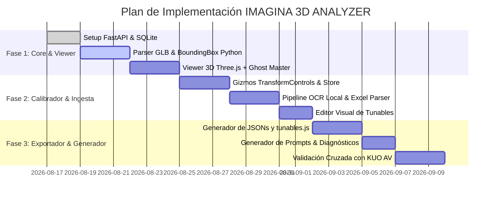

# IMAGINA 3D ANALYZER — ARQUITECTURA TÉCNICA MAESTRA
**Herramienta Local de Ingeniería, Análisis GLB, Calibración Paramétrica y Generación Universal de Productos CAD 3D/2D**

---

## 1. Resumen Ejecutivo
**IMAGINA 3D ANALYZER** es una suite de ingeniería local (Desktop/Web Localhost) concebida para automatizar, calibrar y validar el ciclo de vida de integración de productos de mobiliario modular y sistemas arquitectónicos en el configurador principal **Proyecto_Imagina**.

Nace a partir de las lecciones aprendidas durante la integración y estabilización de ensambles de alta complejidad (**Koncisa Plus** y **KUO AV**), donde se detectó que el proceso manual de comparar mallas maestras de CET/Modelab contra GLBs individuales, descifrar tablas de variantes en Excel, alinear piezas en coordenadas mundiales, resolver colisiones de selección/agrupación (`groupId` vs `instanceId`) y calibrar el anclaje dimensional consume días de prueba y error.

El sistema opera completamente en entorno local (`http://localhost:8000`), combinando un backend analítico en **Python (FastAPI + Trimesh + PyGLTFLib + Pandas + EasyOCR/Tesseract)** con un visualizador interactivo en **Three.js (WebGL + TransformControls + Box3 Inspector)**. Su salida fundamental es un paquete de configuración determinista, versionable en Git (`product.json`, `components.json`, `variants.json`, `relationships.json` y `tunables.js`) y reportes de ingeniería que permiten incorporar cualquier nuevo producto al configurador principal sin modificar el motor core.

---

## 2. Problema Actual en la Cadena de Integración CAD
1. **Dispersión de Fuentes de Verdad**:
   - Modelos maestros exportados de CET Designer o Modelab contienen ensambles consolidados con submallas sin nombres estandarizados ni pivots canónicos.
   - Los GLBs individuales de fábrica frecuentemente vienen centrados en el origen $(0,0,0)$ en lugar de su posición de ensamblaje real, con escalas inconsistentes o rotaciones desalineadas ($\pm 90^\circ, 180^\circ$).
2. **Tablas de Variantes Desconectadas**:
   - Catálogos en Excel/PDF definen códigos de producto y reglas dimensionales (ej. viga $1200\text{ mm} \to \text{KUSO420000\_120.glb}$) que deben traducirse manualmente a código JavaScript.
3. **Rigidez en la Codificación Específica**:
   - Cada nuevo producto históricamente ha requerido escribir un Builder ad-hoc (`KuoAVBuilder.js`, `KoncisaPlusBuilder.js`), un Factory (`createKuoAVInstance.js`) y paneles de UI aislados, duplicando lógica de selección, drag, snap y attachments.
4. **Falta de un Calibrador Visual**:
   - La calibración de offsets milimétricos (ej. inserción de grommet `LKAC250000` con penetración de $32\text{ mm}$ o alineación de vigas `KUSO420000`) se realizaba modificando archivos de script y recargando la aplicación.

---

## 3. Lecciones Aprendidas de KUO AV
1. **Determinismo Físico vs Paramétrico**:
   - No todas las medidas son continuas: KUO AV demostró que el ancho responde a variantes discretas físicas de GLB ($1200, 1500, 1650\text{ mm}$), mientras que las superficies perimetrales y pedestales se ajustan proceduralmente.
2. **Aislamiento Estricto de Identidad (`instanceId` vs `groupId`)**:
   - Un `groupId` genérico o estático (ej. `KUOAV_1200x600_H730_T30`) hace que múltiples mesas del mismo tamaño se agrupen accidentalmente, seleccionándose y moviéndose juntas. **Cada instancia de ensamble debe tener su propio `groupId = instanceId` individual por defecto.**
3. **Estabilidad del Plano de Piso y Cuadrícula**:
   - El piso del mundo (`FLOOR_MAIN`, `isWorldGround: true`) y el `GridHelper` deben permanecer fijos en el origen $(0,0,0)$. No deben recalcularse dinámicamente durante el evento `pointermove` del arrastre.
4. **Desvinculación y Ciclo de Vida de Attachments**:
   - En una unión lateral tipo Bench, arrastrar la mesa primaria (receptora) mueve a la secundaria mediante un `offsetLocal`. Sin embargo, seleccionar y arrastrar directamente la mesa secundaria **debe romper el attachment de inmediato** (`attachment = null`) para otorgar independencia de movimiento.
5. **Separación de Archivos Editables (`tunables.js`)**:
   - Mantener un archivo de calibración canónico desacoplado (`kuoAVTunables.js`) permitió afinar posiciones, rotaciones y offsets en milímetros reales sin alterar la geometría de los modelos GLB.

---

## 4. Lecciones Aprendidas de Koncisa Plus
1. **Jerarquía de Ensambles (`kind: 'KONCISA_PLUS_ASSEMBLY'`)**:
   - La raíz del producto debe ser un `THREE.Group` con metadatos de ensamble (`isPartRoot: true`). Todas las submallas (superficies, patas, vigas, ductos) cuelgan de él.
2. **Resolución de Puntero (`getRootPartObject`)**:
   - El raycast impacta submallas individuales (ej. una viga o un tornillo). La función de resolución debe ascender por la jerarquía hasta encontrar el ensamble raíz antes de activar la sesión de arrastre.
3. **Planta 2D Mediante Transformación Geométrica Pura**:
   - Planta 2D no debe renderizar una cámara ortográfica Three.js duplicada; debe consumir un snapshot de datos planos $(X, Z, W, D, \text{rotY})$ proyectados desde las cajas de colisión 3D (`Box3`).

---

## 5. Arquitectura Propuesta

```
┌─────────────────────────────────────────────────────────────────────────────┐
│                           IMAGINA 3D ANALYZER                              │
├──────────────────────────────────────┬──────────────────────────────────────┤
│          BACKEND (Python/FastAPI)    │       FRONTEND (Three.js / Canvas)   │
│  - Ingesta de Archivos (GLB, XLSX)   │  - Viewport 3D con Dual-Scene:       │
│  - Pipeline OCR Local                │      * Escena A: GLB Master CET      │
│  - Parser Geométrico (PyGLTFLib)     │      * Escena B: Reconstrucción      │
│  - Motor de Bounding Boxes & Diff    │  - Gizmos TransformControls (Local)  │
│  - Generador de Código & Prompts     │  - Inspector de Nodos y BBox         │
│  - Servidor de Assets Estáticos      │  - Editor de Tunables en Tiempo Real │
├──────────────────────────────────────┴──────────────────────────────────────┤
│                         ALMACENAMIENTO HÍBRIDO                              │
│   1. Filesystem Local: Archivos JSON, GLB, Imágenes, Scripts JS             │
│   2. SQLite Local: Registro de Proyectos, Trazabilidad OCR, Historial Diff │
└─────────────────────────────────────────────────────────────────────────────┘
```

---

## 6. Stack Tecnológico

| Capa | Tecnología | Justificación |
| :--- | :--- | :--- |
| **Backend API** | **Python 3.11+ / FastAPI / Uvicorn** | Alto rendimiento asíncrono, tipado estricto con Pydantic, ecosistema científico líder para análisis 3D y tabular. |
| **Análisis 3D / GLB** | **PyGLTFLib + Trimesh + NumPy** | Inspección binaria de buffers glTF/GLB, extracción de matrices de transformación, descomposición de mallas, cálculo exacto de BBoxes y centros de masa. |
| **Ingesta Tabular** | **Pandas + OpenPyXL** | Lectura robusta de listas de precios CET, matrices de variantes, códigos de parte y descripciones dimensionales. |
| **Motor OCR Local** | **RapidOCR / EasyOCR (ONNX Runtime)** | 100% offline, sin dependencias complejas de instalación (no requiere Tesseract nativo en Windows), alta precisión en capturas de pantalla de Modelab/CET. |
| **Frontend Core** | **HTML5 + Vanilla JavaScript (ES Modules)** | Máxima fidelidad con la arquitectura del configurador principal, cero fricción de compilación, ejecución directa. |
| **Render 3D** | **Three.js (r160+)** | Mismo motor que Proyecto_Imagina. Soporte de `GLTFLoader`, `OrbitControls`, `TransformControls`, `Box3Helper`. |
| **Base de Datos** | **SQLite3 (vía SQLAlchemy / aiosqlite)** | Cero configuración, embebida en un único archivo `analyzer.db`, ideal para ejecución monousuario en localhost. |

---

## 7. Diagrama de Flujo de Datos

```
   [Captura CET / Modelab]         [GLB Maestro]         [Excel / CSV CET]
              │                          │                       │
              ▼                          ▼                       ▼
      [Pipeline OCR Local]       [Parser PyGLTFLib]     [Parser Pandas]
              │                          │                       │
              └──────────────┬───────────┴───────────────────────┘
                             ▼
                 [MOTOR DE MATCHING & DIFF]
                 - Asignación de Códigos CET
                 - Mapeo de Submallas a Componentes
                 - Detección de Variantes de Longitud
                             ▼
                 [GENERADOR DE CALIBRACIÓN]
                 - Coordenadas Canónicas (X, Y, Z)
                 - Bounding Box Local & World
                 - Offsets de Inserción / Snap
                             ▼
                 [VISUALIZADOR DUAL THREE.JS]
                 - Master (Ghost Overlay) vs Reconstrucción
                 - Gizmos de Ajuste Fino en Vivo
                             ▼
                 [EXPORTACIÓN DETERMINISTA]
                 ├── product.json
                 ├── components.json
                 ├── variants.json
                 ├── relationships.json
                 ├── tunables.js
                 ├── PRODUCT_DIAGNOSTIC.md
                 └── PROMPT_IMPLEMENTATION.md
```

---

## 8. Estructura de Carpetas del Proyecto

```text
imagina-3d-analyzer/
├── backend/
│   ├── app/
│   │   ├── api/
│   │   │   ├── endpoints/
│   │   │   │   ├── products.py         # CRUD de productos
│   │   │   │   ├── glb_analysis.py     # Inspección de GLBs y árboles de nodos
│   │   │   │   ├── ocr_engine.py       # Extracción de texto sobre capturas
│   │   │   │   ├── calibration.py      # Cálculos de diferencias Master vs Parts
│   │   │   │   ├── exporter.py         # Generación de archivos JS/JSON y prompts
│   │   │   │   └── measurements.py     # Cálculos de distancias y penetración
│   │   ├── core/
│   │   │   ├── config.py               # Rutas locales y settings
│   │   │   └── database.py             # Conexión SQLite local
│   │   ├── models/                     # Modelos SQLAlchemy y esquemas Pydantic
│   │   │   ├── product.py
│   │   │   ├── component.py
│   │   │   └── calibration.py
│   │   ├── services/                   # Lógica analítica pura
│   │   │   ├── gltf_inspector.py
│   │   │   ├── ocr_service.py
│   │   │   ├── variant_detector.py
│   │   │   └── code_generator.py
│   │   └── main.py                     # Entry point FastAPI (CORS, Static Files)
│   ├── requirements.txt
│   └── run_server.py                   # Script de inicio simple: python run_server.py
│
├── frontend/
│   ├── index.html                      # Interfaz principal de la herramienta
│   ├── css/
│   │   ├── main.css                    # Estilos modernos Dark Mode de ingeniería
│   │   └── layout.css
│   ├── js/
│   │   ├── app.js                      # Coordinador general
│   │   ├── api/
│   │   │   └── client.js               # Cliente Fetch hacia FastAPI
│   │   ├── viewer/
│   │   │   ├── ThreeViewer.js          # Viewport Three.js con soporte dual
│   │   │   ├── MasterGhostViewer.js    # Renderizado del modelo maestro en ghost
│   │   │   ├── GizmoController.js      # Control de TransformControls
│   │   │   └── BoxInspector.js         # Visualizador de BoundingBoxes y medidas
│   │   ├── components/
│   │   │   ├── ProductTree.js          # Árbol de piezas detectadas
│   │   │   ├── CalibrationPanel.js     # Formulario de coordenadas y tunables
│   │   │   ├── OCRPanel.js             # Visualizador de evidencias y texto extraído
│   │   │   └── DiffViewer.js           # Comparativa de medidas Master vs Partes
│   │   └── state/
│   │       └── store.js                # Estado reactivo del cliente
│
├── workspace/                          # Almacén de productos inspeccionados
│   ├── kuo-av/
│   │   ├── config/
│   │   │   ├── product.json
│   │   │   ├── components.json
│   │   │   ├── variants.json
│   │   │   ├── relationships.json
│   │   │   ├── calibration.json
│   │   │   └── tunables.js
│   │   ├── models/
│   │   │   ├── master/
│   │   │   │   └── KUO_AV_MASTER.glb
│   │   │   └── parts/
│   │   │       ├── KUSO420000_120.glb
│   │   │       ├── KUSO860000_120.glb
│   │   │       ├── KUAC650000.glb
│   │   │       └── LKAC250000.glb
│   │   ├── evidence/
│   │   │   ├── ocr_captura_01.png
│   │   │   └── lista_precios_cet.xlsx
│   │   └── exports/
│   │       ├── KUO_AV_DIAGNOSTIC.md
│   │       └── KUO_AV_PROMPT_IMPLEMENTATION.md
│
├── data/
│   └── analyzer.db                     # Base de datos SQLite local
└── README.md
```

---

## 9. Modelo de Datos y Esquemas

### A. SQLite (Metadatos y Trazabilidad)
* **`products`**: `id`, `slug`, `name`, `category`, `created_at`, `status`.
* **`evidence_files`**: `id`, `product_id`, `filename`, `file_type` (IMAGE, EXCEL, GLB_MASTER, GLB_PART), `file_path`.
* **`ocr_detections`**: `id`, `evidence_id`, `raw_text`, `detected_code`, `confidence`, `bbox_json`.
* **`calibration_sessions`**: `id`, `product_id`, `updated_at`, `is_validated`.

### B. Archivos JSON (Fuentes de Verdad de Ingeniería)
Todos los datos de producto son archivos JSON puros en `workspace/{product-slug}/config/`, permitiendo inspección humana directa y control de versiones Git.

---

## 10. Modelo de Productos (`product.json`)
```json
{
  "schemaVersion": "1.0.0",
  "product": {
    "id": "KUO_AV",
    "slug": "kuo-av",
    "name": "Kuo AV — Superficie Perimetral",
    "category": "SUPERFICIES",
    "family": "KUO",
    "kind": "KUO_AV_ASSEMBLY",
    "defaultDimensionsMm": {
      "width": 1200,
      "depth": 600,
      "height": 730,
      "thickness": 30
    },
    "allowedWidthsMm": [1200, 1500, 1650],
    "allowedDepthsMm": [600, 700, 800],
    "allowedHeightsMm": [730, 750],
    "allowedThicknessesMm": [18, 25, 30]
  }
}
```

---

## 11. Modelo de Componentes (`components.json`)
```json
{
  "components": [
    {
      "id": "superficie_perimetral",
      "role": "superficie",
      "type": "procedural_surface",
      "logicalCode": "KUO_AV_SURFACE",
      "name": "Superficie Perimetral Kuo AV",
      "modelKind": "procedural",
      "isStructural": true,
      "receivesAccessories": true
    },
    {
      "id": "viga_soporte",
      "role": "viga",
      "type": "viga",
      "logicalCode": "KUSO420000",
      "name": "Viga Kuo AV",
      "modelKind": "glb",
      "hasVariants": true,
      "variantGroup": "KUSO420000_VARIANTS"
    },
    {
      "id": "vertebra_vertical",
      "role": "vertebra",
      "type": "vertebra",
      "logicalCode": "KUAC650000",
      "code": "KUAC650000",
      "name": "Vértebra Pasacables Lateral",
      "modelKind": "glb",
      "src": "/assets/models/Kuo AV/KUAC650000.glb",
      "isOptional": true,
      "defaultEnabled": false
    },
    {
      "id": "grommet_aluminio",
      "role": "grommet",
      "type": "grommet",
      "logicalCode": "LKAC250000",
      "code": "LKAC250000",
      "name": "Grommet Pasacables Abatible",
      "modelKind": "glb",
      "src": "/assets/models/Kuo AV/LKAC250000.glb",
      "isOptional": true,
      "defaultEnabled": false
    }
  ]
}
```

---

## 12. Modelo de Variantes Físicas (`variants.json`)
```json
{
  "variantGroups": {
    "KUSO420000_VARIANTS": {
      "codeBase": "KUSO420000",
      "parameter": "width",
      "resolutionRule": "MATCH_EXACT_OR_NEXT_LOWER",
      "variants": [
        {
          "conditionValue": 1200,
          "code": "KUSO420000_120",
          "src": "/assets/models/Kuo AV/KUSO420000_120.glb",
          "measuredSpanMm": 1134.0
        },
        {
          "conditionValue": 1500,
          "code": "KUSO420000_150",
          "src": "/assets/models/Kuo AV/KUSO420000_150.glb",
          "measuredSpanMm": 1434.0
        },
        {
          "conditionValue": 1650,
          "code": "KUSO420000_165",
          "src": "/assets/models/Kuo AV/KUSO420000_165.glb",
          "measuredSpanMm": 1584.0
        }
      ]
    },
    "KUSO860000_VARIANTS": {
      "codeBase": "KUSO860000",
      "parameter": "width",
      "resolutionRule": "MATCH_EXACT_OR_NEXT_LOWER",
      "variants": [
        {
          "conditionValue": 1200,
          "code": "KUSO860000_120",
          "src": "/assets/models/Kuo AV/KUSO860000_120.glb",
          "measuredSpanMm": 900.0
        },
        {
          "conditionValue": 1500,
          "code": "KUSO860000_150",
          "src": "/assets/models/Kuo AV/KUSO860000_150.glb",
          "measuredSpanMm": 1200.0
        },
        {
          "conditionValue": 1650,
          "code": "KUSO860000_165",
          "src": "/assets/models/Kuo AV/KUSO860000_165.glb",
          "measuredSpanMm": 1350.0
        }
      ]
    }
  }
}
```

---

## 13. Modelo de Calibración Canónica (`calibration.json`)
```json
{
  "calibration": {
    "superficie": {
      "positionMm": { "x": 0.0, "y": 715.0, "z": 0.0 },
      "rotationDeg": { "x": 0.0, "y": 0.0, "z": 0.0 },
      "scale": { "x": 1.0, "y": 1.0, "z": 1.0 }
    },
    "costado_izquierdo": {
      "positionMm": { "x": -567.0, "y": 0.0, "z": 0.0 },
      "rotationDeg": { "x": 0.0, "y": 0.0, "z": 0.0 },
      "scale": { "x": 1.0, "y": 1.0, "z": 1.0 }
    },
    "costado_derecho": {
      "positionMm": { "x": 567.0, "y": 0.0, "z": 0.0 },
      "rotationDeg": { "x": 0.0, "y": 0.0, "z": 0.0 },
      "scale": { "x": 1.0, "y": 1.0, "z": 1.0 }
    },
    "viga": {
      "positionMm": { "x": 0.0, "y": 665.0, "z": 0.0 },
      "rotationDeg": { "x": 0.0, "y": 0.0, "z": 0.0 },
      "scale": { "x": 1.0, "y": 1.0, "z": 1.0 }
    },
    "ducto": {
      "positionMm": { "x": 0.0, "y": 605.0, "z": -120.0 },
      "rotationDeg": { "x": 0.0, "y": 0.0, "z": 0.0 },
      "scale": { "x": 1.0, "y": 1.0, "z": 1.0 }
    },
    "vertebra": {
      "positionMm": { "x": -556.0, "y": 2.0, "z": 105.0 },
      "rotationDeg": { "x": 0.0, "y": 180.0, "z": 0.0 },
      "scale": { "x": 1.0, "y": 1.0, "z": 1.0 }
    },
    "grommet": {
      "positionMm": { "x": -256.0, "y": 696.44, "z": -184.62 },
      "rotationDeg": { "x": 0.0, "y": 0.0, "z": 0.0 },
      "scale": { "x": 1.0, "y": 1.0, "z": 1.0 }
    }
  }
}
```

---

## 14. Modelo de Relaciones y Anclajes (`relationships.json`)
```json
{
  "relationships": [
    {
      "sourceComponent": "superficie",
      "targetComponent": "WORLD",
      "type": "REST_ON_TOP",
      "constraint": { "topElevationMm": "param.height" }
    },
    {
      "sourceComponent": "viga",
      "targetComponent": "superficie",
      "type": "ATTACH_UNDER",
      "offsetMm": { "y": -50.0 }
    },
    {
      "sourceComponent": "ducto",
      "targetComponent": "viga",
      "type": "ATTACH_UNDER",
      "offsetMm": { "y": -60.0, "z": -120.0 }
    },
    {
      "sourceComponent": "grommet",
      "targetComponent": "superficie",
      "type": "EMBEDDED_SURFACE",
      "anchor": "TOP_SURFACE",
      "embeddingDepthMm": 32.0,
      "alignment": { "x": "LEFT_OFFSET_256MM", "z": "REAR_OFFSET_184MM" }
    },
    {
      "sourceComponent": "vertebra",
      "targetComponent": "costado_izquierdo",
      "type": "ATTACH_LATERAL",
      "groundContact": true,
      "offsetMm": { "x": 11.0, "y": 2.0, "z": 105.0 }
    }
  ]
}
```

---

## 15. Sistema de OCR e Ingesta de Evidencias
1. **Pipeline de Procesamiento**:
   - Carga de imágenes PNG, JPG o páginas de PDF renderizadas como mapas de bits a 300 DPI.
   - Procesamiento local mediante **RapidOCR / EasyOCR**.
   - Normalización de texto y extracción de patrones de códigos CET mediante expresiones regulares:
     `\b[A-Z]{2,4}[A-Z0-9]{5,8}\b` (ej. `KUAC650000`, `KUSO420000_120`, `LKAC250000`).
2. **Trazabilidad de Confianza**:
   - Cada dato extraído se almacena con su procedencia:
     ```json
     {
       "field": "code",
       "value": "KUAC650000",
       "sourceType": "OCR",
       "sourceFile": "captura_modelab_02.png",
       "confidence": 0.985,
       "boundingBox": [120, 340, 280, 365]
     }
     ```
   - Si un dato proviene de Excel (`sourceType: "EXCEL"`) o del GLB Maestro (`sourceType: "MASTER_GLB"`), tiene precedencia de confianza sobre el OCR.

---

## 16. Sistema de Análisis de Mallas GLB
El backend en Python analiza cualquier archivo `.glb` subido y genera una radiografía estructural:
1. **Jerarquía y Nodos**:
   - Árbol de nodos, nombres de nodos (`node.name`), matrices locales y mundiales (`matrix` / `translation` / `rotation` / `scale`).
2. **Primitivas Geométricas**:
   - Conteo de vértices, triángulos, número de mallas (`meshes`), canales de coordenadas de textura (UVs).
3. **Bounding Boxes Exactos**:
   - BBox Local (en espacio de modelo): `min [x, y, z]`, `max [x, y, z]`, `size [w, h, d]`.
   - BBox Mundial (tras aplicar la matriz de transformación del nodo).
4. **Inspección de Materiales**:
   - `material.pbrMetallicRoughness`, factores de color base, opacidad/transparencia, mapas de textura asociados.

---

## 17. Comparador Master vs Componentes Individuales
El comparador permite superponer el modelo maestro consolidado exportado desde CET con el ensamble reconstruido a partir de GLBs individuales:

1. **Modo Ghost Overlay**:
   - El GLB Master se renderiza en Three.js con un material traslúcido tipo "Ghost" (azul/cian wireframe semitransparente, `opacity: 0.3`, `depthWrite: false`).
   - Las piezas individuales reconstruidas se renderizan con sus materiales estándar sólidos.
2. **Diff Métrico Automatizado**:
   - Comparación del BBox mundial acumulado:
     $$\Delta X = |\text{BBox}_{\text{Master}}.X - \text{BBox}_{\text{Reconstruido}}.X|$$
     $$\Delta Y = |\text{BBox}_{\text{Master}}.Y - \text{BBox}_{\text{Reconstruido}}.Y|$$
     $$\Delta Z = |\text{BBox}_{\text{Master}}.Z - \text{BBox}_{\text{Reconstruido}}.Z|$$
   - Detección de mallas no mapeadas en el Master (piezas faltantes) o mallas individuales sobrantes.

---

## 18. Calibrador Visual 3D Interactivo
Permite al diseñador/ingeniero realizar el ajuste fino en el navegador:
- **TransformControls en Modo Local/World**: Gizmos de traslación $(X, Y, Z)$ y rotación $(RX, RY, RZ)$.
- **Snap Numérico en Tiempo Real**: Incrementos configurables ($1\text{ mm}, 5\text{ mm}, 10\text{ mm}, 45^\circ, 90^\circ$).
- **Controles de Inserción / Embedding**: Modificación directa de la penetración de accesorios sobre superficies receptoras.
- **Botón "Guardar Calibración"**: Escribe inmediatamente los deltas en `calibration.json` y `tunables.js` sin reiniciar la sesión.

---

## 19. Sistema Universal de Interacción 3D y Planta 2D

```
                ┌──────────────────────────────────────────────┐
                │         INSTANCIA DE PRODUCTO                │
                │         kind: 'PRODUCT_ASSEMBLY'             │
                │         instanceId: 'KUOAV_xxxx' (ÚNICO)     │
                │         groupId: 'KUOAV_xxxx' (ÚNICO)        │
                │         isPartRoot: true                     │
                └──────────────────────┬───────────────────────┘
                                       │
                    ┌──────────────────┴──────────────────┐
                    ▼                                     ▼
           [MOTOR 3D THREE.JS]                   [PLANTA 2D CAD]
     - Raycast sobre submalla              - Rectángulo 2D por instancia
     - getRootPartObject(hit)              - Identidad ligada a instanceId
     - Desactiva OrbitControls             - Movimiento libre en (X, Z)
     - Drag horizontal en (X, Z)           - Sincronización en tiempo real
     - Cota fija de piso (Y = 0)           - Snap y Cotas CAD
                    │                                     │
                    └──────────────────┬──────────────────┘
                                       ▼
                         ATTACHMENTS ENTRE ENSAMBLES
                         - Snap Lateral Bench (Puesto continuo)
                         - Offset local vinculado
                         - Ruptura automática al arrastrar hijo
```

---

## 20. Sistema Universal de `productTunables.js`

El archivo `productTunables.js` (o específico por producto `kuoAVTunables.js`) es una **fuente de verdad canónica, editable manualmente por humanos y versionable con Git**:

```javascript
/**
 * productTunables.js — Overrides y Calibración Manual de Producto
 * Este archivo puede ser editado directamente o generado por IMAGINA 3D ANALYZER.
 */

export const PRODUCT_TUNABLES = {
  // 1. Overrides de Calibración Geométrica (en milímetros y grados)
  calibration: {
    superficie: {
      posicionMm: { x: 0, y: 715, z: 0 },
      rotacionDeg: { x: 0, y: 0, z: 0 },
      escala: { x: 1, y: 1, z: 1 },
      offsetMm: { x: 0, y: 0, z: 0 },
    },
    viga: {
      posicionMm: { x: 0, y: 665, z: 0 },
      rotacionDeg: { x: 0, y: 0, z: 0 },
      escala: { x: 1, y: 1, z: 1 },
      offsetMm: { x: 0, y: 0, z: 0 },
    },
    ducto: {
      posicionMm: { x: 0, y: 605, z: -120 },
      rotacionDeg: { x: 0, y: 0, z: 0 },
      escala: { x: 1, y: 1, z: 1 },
      offsetMm: { x: 0, y: 0, z: 0 },
    },
    vertebra: {
      posicionMm: { x: -556, y: 2, z: 105 },
      rotacionDeg: { x: 0, y: 180, z: 0 },
      escala: { x: 1, y: 1, z: 1 },
      offsetMm: { x: 0, y: 0, z: 0 },
      enabled: false,
    },
    grommet: {
      posicionMm: { x: -256, y: 696.44, z: -184.62 },
      rotacionDeg: { x: 0, y: 0, z: 0 },
      escala: { x: 1, y: 1, z: 1 },
      offsetMm: { x: 0, y: 0, z: 0 },
      enabled: false,
      embeddingDepthMm: 32.0,
    },
  },

  // 2. Mapeo de Variantes Físicas Discretas
  variants: {
    viga: {
      1200: 'KUSO420000_120.glb',
      1500: 'KUSO420000_150.glb',
      1650: 'KUSO420000_165.glb',
    },
    ducto: {
      1200: 'KUSO860000_120.glb',
      1500: 'KUSO860000_150.glb',
      1650: 'KUSO860000_165.glb',
    },
  },

  // 3. Reglas de Interacción y Snapping
  interaction: {
    allowBenchSnap: true,
    benchSnapThresholdM: 0.25,
    lockElevationY: 0.0,
    isolateInstances: true,
  },

  // 4. Flags de Diagnóstico y Logs
  debug: {
    verboseLogs: true,
    logPrefix: '[PRODUCT ENGINE DEBUG]',
  },
};
```

---

## 21. Generación Automática de Diagnósticos (`PRODUCT_DIAGNOSTIC.md`)
El Analyzer genera automáticamente reportes Markdown estructurados con:
- Resumen de GLBs analizados vs GLBs esperados en catálogo.
- Tabla comparativa de dimensiones nominales vs mallas 3D.
- Resultado de validación dimensional (PASS, WARNING, ERROR).
- Trazabilidad de códigos CET y evidencias OCR.

---

## 22. Generador Automático de Prompts para Claude Pro / Gemini (`PROMPT_IMPLEMENTATION.md`)
Permite exportar un prompt técnico completo y listo para copiar/pegar al asistente de IA para incorporar el producto al configurador principal:

```markdown
# PROMPT TÉCNICO DE IMPLEMENTACIÓN — {PRODUCT_NAME}

## 1. Contexto del Producto
- Nombre: {product.name}
- Slug: {product.slug}
- Tipo de Ensamble: {product.kind}

## 2. Variantes GLB Físicas Validadas
- Ancho 1200 mm -> Viga: KUSO420000_120.glb | Ducto: KUSO860000_120.glb
- Ancho 1500 mm -> Viga: KUSO420000_150.glb | Ducto: KUSO860000_150.glb
- Ancho 1650 mm -> Viga: KUSO420000_165.glb | Ducto: KUSO860000_165.glb

## 3. Calibración Canónica de Componentes (productTunables.js)
{calibration_json_formatted}

## 4. Archivos a Generar en Proyecto_Imagina
- src/mepal/{product_slug}/builder/{Product}Builder.js
- src/mepal/{product_slug}/factory/create{Product}Instance.js
- src/mepal/{product_slug}/config/{product}Tunables.js

## 5. Reglas Críticas de No Regresión
- Mantener instanceId y groupId únicos por ensamble para selección y drag aislados.
- Fijar Y = 0 mm en el ensamble raíz y en el plano del piso.
- Respetar contratos de ThreeCanvas (getPartsSnapshot2D, movePartToXZ, snap).
```

---

## 23. Mapeo: Actual KUO AV $\to$ Nueva Arquitectura Universal

| Elemento Actual KUO AV | Elemento en IMAGINA 3D ANALYZER | Rol en Nueva Arquitectura |
| :--- | :--- | :--- |
| `KuoAVBuilder.js` | `ProductAssemblyBuilder` + `components.json` | Builder determinista genérico alimentado por esquema JSON y reglas de variantes. |
| `kuoAVTunables.js` | `productTunables.js` / `calibration.json` | Calibración manual y overrides de coordenadas, rotaciones y offsets en milímetros. |
| `createKuoAVInstance.js` | `createProductInstance` Factory | Instanciador universal Three.js que crea el `THREE.Group` raíz con metadatos y subpartes. |
| `KuoAVProperties.jsx` | `ProductPropertiesPanel` dinámico | Panel React generado automáticamente según las propiedades y variantes declaradas. |
| `snapKuoAVAssembly` | `UniversalBenchSnapEngine` | Motor genérico de snap horizontal lateral para cualquier ensamble con cota de piso $Y=0$. |
| Scripts de prueba en `scratch/` | `TestRunner` automatizado de Python/Node | Suite de validación geométrica y de interacción ejecutada en 1 clic. |

---

## 24. Plan de Implementación por Fases



---

## 25. Criterios de Aceptación y Calidad
1. **Zero Cloud Dependency**: La herramienta debe iniciar y ejecutar todas sus funciones (análisis GLB, OCR, visualización, exportación) en `localhost` sin conexión a internet.
2. **Determinismo Geométrico**: Las medidas extraídas de un GLB mediante Python deben coincidir exactamente ($\pm 0.01\text{ mm}$) con las calculadas por Three.js en el cliente.
3. **No Regresión**: El paquete de configuración generado para KUO AV mediante el Analyzer debe producir un ensamble 100% idéntico al que hoy funciona en Proyecto_Imagina.
4. **Persistencia Transparente**: Todo cambio realizado en la interfaz visual 3D debe guardarse directamente en archivos `.json` y `.js` en el disco local.

---

## 26. Primer MVP Recomendado

Para obtener valor inmediato sin sobrecargar el desarrollo, el **MVP Fase 1** debe enfocarse en:
1. **Backend FastAPI mínimo**:
   - Endpoint `/api/analyze-glb` que recibe un `.glb` y retorna su árbol de nodos, jerarquía, BBoxes locales/mundiales y dimensiones en milímetros.
   - Endpoint `/api/compare-master-parts` que recibe el GLB Master y la lista de GLBs de componentes y calcula los deltas de BBox.
2. **Frontend Three.js de Inspección**:
   - Visualizador dual: Master en modo Ghost (cian semitransparente) + Componentes en sólido.
   - Panel lateral con árbol de piezas y coordenadas $(X, Y, Z, RX, RY, RZ)$.
   - Gizmo de traslación/rotación para ajustar piezas en vivo.
3. **Exportador de `tunables.js`**:
   - Botón "Exportar Calibración" que descarga el archivo JavaScript listo para ser usado en el proyecto.

---

## 27. PROMPT LISTO PARA LA FASE 1 (Copiar a Claude Pro)

```markdown
PROMPT DE INICIO — FASE 1: IMAGINA 3D ANALYZER (CORE & GLB VIEWER)

Hola Claude. Vamos a iniciar el desarrollo del MVP Fase 1 de IMAGINA 3D ANALYZER, una herramienta local de ingeniería y calibración 3D para configuradores de mobiliario.

Contexto y Arquitectura:
- Backend: Python 3.11+ con FastAPI, PyGLTFLib, Trimesh, NumPy, Uvicorn.
- Frontend: HTML5, JavaScript ES Modules, Three.js (r160+).
- Ejecución: 100% local en http://localhost:8000.
- Propósito de la Fase 1: Cargar un GLB maestro de CET/Modelab y GLBs individuales de componentes, analizarlos geométricamente, compararlos visualmente en Three.js con modo Ghost Overlay, ajustar coordenadas con TransformControls y exportar la tabla de calibración tunables.js.

Por favor, genera la estructura base y el código completo funcional para:

1. backend/main.py y backend/services/gltf_inspector.py:
   - Servidor FastAPI con CORS y servicio de archivos estáticos.
   - Endpoint POST /api/inspect-glb que lea un archivo .glb binario y extraiga: nodos, jerarquía, mallas, vértices, matrices mundiales, BBox min/max y dimensiones exactas (widthMm, heightMm, depthMm).
   - Endpoint POST /api/export-tunables que reciba el JSON de calibración y genere el archivo JavaScript formateado.

2. frontend/index.html y frontend/js/viewer/ThreeViewer.js:
   - Interfaz moderna de ingeniería (Dark Theme).
   - Viewport Three.js con OrbitControls, luces de estudio, grid milimétrica en el piso fija en [0, 0, 0].
   - Carga simultánea de:
     a) Modelo Maestro (Ghost semi-transparente cian, depthWrite: false).
     b) Componentes individuales (Mallas sólidas con colores diferenciados).
   - Integración de TransformControls para mover/rotar componentes seleccionados.
   - Panel lateral que muestre la posición [X, Y, Z] en milímetros y botón "Descargar tunables.js".

3. run_server.py y requirements.txt:
   - Script de inicio rápido de 1 solo comando.

Por favor entrega el código completo, modular y listo para ejecutar sin dependencias cloud.
```
